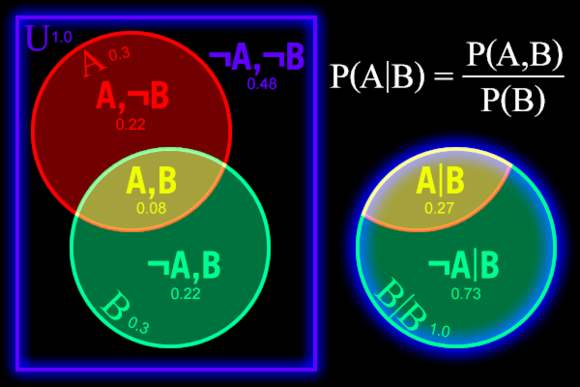

## 概率

### 条件概率

事件 $B$ 已发生的情况下, 事件 $A$ 发生的概率. 

如下图, 蓝色框 $U$ 中随机选取一个点. 则该点落入红色圈 $A$ 中的概率为 $P(A)$ (红圈 $A$ 的面积除以蓝色框 $U$ 的面积). 落入绿色圈中的概率为 $P(B)$. $A, B$ 事件同时发生的概率为 $P(A, B)$ 黄色区域的面积除以蓝色框 $U$ 的面积. 

而条件概率为: 已知该点已经落在绿色圈中, 即事件 $B$ 已发生, 求事件 $A$ 发生的概率. 为 $P(A \vline B)$, 为下图右边, 黄色区域除以绿色区域的面积. 

$$\begin{aligned} P(A \vline B) = \frac{P(A, B)}{P(B)} \end{aligned}$$

#### 独立事件

独立事件指事件 $B$ 发生与否, 事件 $A$ 发生的概率都不变. 即: 

$$\begin{aligned} P(A) = P(A \vline B) = \frac{P(A, B)}{P(B)} \end{aligned}$$

事件 $A$ 单独发生的概率 $P(A)$ 等于事件 $B$ 发生后事件 $A$ 现发生的概率 $P(A \vline B)$ , 同时也等于事件 $非B$ 发生后, 事件 $A$ 发生的概率 $P(A \vline \hat B)$. 

注意: 

* $A$, $B$ 两圆完全分开, 则 $A$, $B$ 是互斥. 
* 两圆的交集 $(A, B)$ 应刚好满足 $P(A) = \frac{P(A, B)}{P(B)}$, $A$, $B$ 才是独立事件. 

### 相关性

两个相互独立的随机变量 $X$, $Y$. 概率密度函数为 $f_{X}(x), f_{Y}(y)$. $X$ 的发生不影响 $Y$ 的发生概率. 则 $X$ 为任意值时, $Y$ 的概率密度函数 $f_{Y}(y)$ 不变则 $X, Y$ 的联合概率密度函数为 $f(x, y) = f_{X}(x) f_{Y}(y)$. 

设 $X, Y$ 的期望都为 $0$. 有: 

$$\begin{aligned} \int_{- \infty}^{+ \infty}{xy f(x, y) \text{d} x \text{d} y} = \int_{- \infty}^{+ \infty}{xy f_{X}(x) f_{Y}(y) \text{d} x \text{d} y}  \end{aligned}$$ 

 ### 期望

设 X, Y 是两个随机变量, 则有: 

$$\begin{aligned} E(X+Y) = E(X) + E(Y) \end{aligned}$$

证明: 

设二维随机变量 $(X, Y)$ 的概率密度为 $f(x, y)$ 其边缘概率密度为 $f_{X}(x)$, $f_{Y}(y)$. 

$$\begin{aligned} E(X+Y) &= \int_{-\infty}^{+\infty} \int_{-\infty}^{+\infty}{(x+y) f(x, y) dxdy} \\ &= \int_{-\infty}^{+\infty} \int_{-\infty}^{+\infty}{x f(x, y) dxdy} + \int_{-\infty}^{+\infty} \int_{-\infty}^{+\infty}{y f(x, y) dxdy} \\ &= \int_{-\infty}^{+\infty}{x \int_{-\infty}^{+\infty}{f(x, y)}dy}dx + \int_{-\infty}^{+\infty}{y \int_{-\infty}^{+\infty}{f(x, y)}dx}dy \\ &= \int_{-\infty}^{+\infty}{x f_{X}(x)}dx + \int_{-\infty}^{+\infty}{y f_{Y}(y)}dy \\ &= E(X) + E(Y) \end{aligned}$$

### 方差

$$\begin{aligned} D(X) = E(X^{2}) - E^{2}(X) \end{aligned}$$

### 样本估计

概率论与数理统计 P105

由样本来估计真实分布的期望和方差. 

https://blog.csdn.net/KID_yuan/article/details/84783671

#### 用样本估计真实分布的期望和方差

设有一组样本值为: $X = \{X_{1}, X_{2}, \cdot \cdot \cdot , X_{n} \}$. 各样本相互独立, 且都服从同一分布 $N(\mu, \sigma)$. 

令: $Y = \frac{1}{n} \sum_{i=1}^{n}{X_{i}}$. 

##### 用样均值可以估计真实分布的期望

$$\begin{aligned} E(Y) &= E(\frac{1}{n} \sum_{i=1}^{n}{X_{i}}) \\ &= \frac{1}{n}E(\sum_{i=1}^{n}{X_{i}}) \\ &= \frac{1}{n}E(X_{1} + X_{2} + \cdot \cdot \cdot + X_{n}) \\ &= \frac{1}{n} \int_{G}{(x_{1} + x_{2} + \cdot \cdot \cdot + x_{n}) f(x_{1}, x_{2}, \cdot \cdot \cdot, x_{n}) dx_{i}} \text{此处到下一步的变换只针对正态分布时, 满足. } \\ &= \frac{1}{n} \int_{-\infty}^{+\infty}{x_{1}f_{x_{1}}(x_{1})}dx_{1} + \frac{1}{n} \int_{-\infty}^{+\infty}{x_{2}f_{x_{2}}(x_{2})}dx_{2} + \cdot \cdot \cdot + \frac{1}{n} \int_{-\infty}^{+\infty}{x_{n}f_{x_{n}}(x_{n})}dx_{n} \\ &= \frac{1}{n} E(X_{1}) + \frac{1}{n} E(X_{2}) + \cdot \cdot \cdot + \frac{1}{n} E(X_{n}) \\ &= \mu \end{aligned}$$

##### 样本均值估计期望时的可信度方差

$$\begin{aligned} D(Y) &= E((\frac{1}{n} \sum_{i=1}^{n}{X_{i}} - \mu)^{2}) \\ &= E((\frac{\sum_{i=1}^{n}{X_{i}} - n \mu}{n} )^{2}) \\ &= \frac{1}{n^{2}} E(\sum_{i=1}^{n}{(X_{i}} - \mu )^{2}) \\ &= \frac{1}{n^{2}} \sum_{i=1}^{n}{E((X_{i}} - \mu )^{2}) \\ &= \frac{1}{n^{2}} \sum_{i=1}^{n}{\sigma^{2}}) \\ &= \frac{\sigma^{2}}{n} \end{aligned}$$

备注: 

* 多个正态分布的变量的线性组合仍然是正态分布. 所以求样本的均值后的分布仍是正态分布. 

##### 从样本估计真实分布的方差

$$\begin{aligned} E(S^{2}) &= E(\frac{1}{n-1}\sum_{i=1}^{n}{(X_{i} - \bar{X})^{2}}) \\ &= \frac{1}{n-1} E(\sum_{i=1}^{n}{(X_{i} - \bar{X})^{2}}) \\ &= \frac{1}{n-1} E(\sum_{i=1}^{n}{(X_{i}^{2} - 2\bar{X}X_{i} + \bar{X}^{2})}) \\ &= \frac{1}{n-1}E(\sum_{i=1}^{n}{X_{i}^{2}} - 2\bar{X}\sum_{i=1}^{n}{X_{i}} + \sum_{i=1}^{n}{\bar{X}^{2}}) \\ &= \frac{1}{n-1}E(\sum_{i=1}^{n}{X_{i}^{2}} - 2\bar{X} \times n\bar{X} + n\bar{X}^{2}) \\ &= \frac{1}{n-1}E(\sum_{i=1}^{n}{X_{i}^{2}} - 2n\bar{X}^{2} + n\bar{X}^{2}) \\ &= \frac{1}{n-1}E(\sum_{i=1}^{n}{X_{i}^{2}} - n\bar{X}^{2}) \\ &= \frac{1}{n-1}(\sum_{i=1}^{n}E({X_{i}^{2}}) - nE(\bar{X}^{2})) \\ &= \frac{1}{n-1}(\sum_{i=1}^{n}{(D(X_{i}) + E^{2}(X_{i}))} - n(D(\bar{X}) + E^{2}(\bar{X}))) \\ &= \frac{1}{n-1}(\sum_{i=1}^{n}{(\sigma^{2} + \mu^{2})} - n(\sigma^{2}/n + \mu^{2})) \\ &= \frac{1}{n-1}(n(\sigma^{2} + \mu^{2}) - n(\sigma^{2}/n + \mu^{2})) \\ &= \frac{1}{n-1}(n\sigma^{2} + n\mu^{2} - \sigma^{2} - n\mu^{2})) \\ &= \frac{1}{n-1}(n-1)\sigma^{2} \\ &= \sigma^{2} \end{aligned}$$

#### 服从正态分布的样本, 最大似然估计期望和方差

假设样本 $X=\{ X_{1}, X_{2}, \cdot \cdot \cdot , X_{n} \}$, 相互独立, 且服从正态分布: $N(\mu, \sigma^{2})$, 通过似然估计求期望 $\mu$ 和方差 $\sigma$. 

**似然函数**(计算当前抽样, 发生的概率): 

$$\begin{aligned} L(\mu, \sigma^{2}) &= \prod_{i=1}^{N} \frac{1}{\sqrt{2 \pi} \sigma} e^{- \frac{(X_{i} - \mu)^{2}}{2 \sigma^{2}}} \\ &= (\frac{1}{\sqrt{2 \pi} \sigma})^{N} e^{- \frac{1}{2 \sigma^{2}} \sum_{i=1}^{N}{(X_{i} - \mu)^{2}}} \end{aligned}$$

求使得似然函数 $L(\mu, \sigma^{2})$ 最大的期望 $\mu$ 和方差 $\sigma$. 也就是求下式的最大值. 

$$\begin{aligned} \ln{L(\mu, \sigma^{2})} &= \ln{(\frac{1}{\sqrt{2 \pi} \sigma})^{N} e^{- \frac{1}{2 \sigma^{2}} \sum_{i=1}^{N}{(X_{i} - \mu)^{2}}}} \\ &= N \times \ln {\frac{1}{\sqrt{2 \pi} \sigma} + (- \frac{1}{2 \sigma^{2} } \sum_{i=1}^{N}{(X_{i} - \mu)^{2}}}) \\ &= - N \times \ln {\sqrt{2 \pi} \sigma + (- \frac{1}{2 \sigma^{2} } \sum_{i=1}^{N}{(X_{i} - \mu)^{2}}}) \\ &= - N \times \ln {\sqrt{2 \pi} \sigma - \frac{1}{2 \sigma^{2} } \sum_{i=1}^{N}{(X_{i} - \mu)^{2}}} \\ &= - N \ln {\sqrt{2 \pi}} - N \ln {\sigma} - \frac{1}{2 \sigma^{2}} \sum_{i=1}^{N}{(X_{i} - \mu)^{2}} \\ &= - \frac{N}{2} \ln {2 \pi} - \frac{N}{2} \ln {\sigma^{2}} - \frac{1}{2 \sigma^{2} } \sum_{i=1}^{N}{(X_{i} - \mu)^{2}} \end{aligned}$$

求偏导: 

$$\begin{aligned} \frac{\partial \ln{L(\mu, \sigma^{2})}}{\partial \mu} &= \frac{\partial ( - \frac{N}{2} \ln {2 \pi} - \frac{N}{2} \ln {\sigma^{2}} - \frac{1}{2 \sigma^{2} } \sum_{i=1}^{N}{(X_{i} - \mu)^{2}})}{\partial \mu} \\ &= \frac{\partial (- \frac{1}{2 \sigma^{2} } \sum_{i=1}^{N}{(X_{i} - \mu)^{2}})}{\partial \mu} \\ &= - \frac{1}{2 \sigma^{2}} \sum_{i=1}^{N}{-2(X_{i} - \mu)} \\ &= \frac{1}{2 \sigma^{2} } \sum_{i=1}^{N}{2(X_{i} - \mu)} \\ &= \frac{1}{ \sigma^{2}} \sum_{i=1}^{N}{(X_{i} - \mu)} \\ &= \frac{1}{ \sigma^{2}} \times (\sum_{i=1}^{N}{X_{i}} - N \mu) \end{aligned}$$

$$\begin{aligned} \frac{\partial \ln{L(\mu, \sigma^{2})}}{\partial \sigma^{2}} &= \frac{\partial ( - \frac{N}{2} \ln {2 \pi} - \frac{N}{2} \ln {\sigma^{2}} - \frac{1}{2 \sigma^{2} } \sum_{i=1}^{N}{(X_{i} - \mu)^{2}})}{\partial \sigma^{2}} \\ &= \frac{\partial (- \frac{N}{2} \ln {\sigma^{2}} - \frac{1}{2 \sigma^{2} } \sum_{i=1}^{N}{(X_{i} - \mu)^{2}})}{\partial \sigma^{2}} \\ &= -\frac{N}{2} \times \frac{1}{\sigma^{2}} + \frac{1}{2 \sigma^{4}}\sum_{i=1}^{N}{(X_{i} - \mu)^{2}} \\ &= -\frac{N}{2 \sigma^{2}} + \frac{1}{2 \sigma^{4}}\sum_{i=1}^{N}{(X_{i} - \mu)^{2}} \end{aligned}$$

求极值点: 

令: 

$$\begin{aligned} \frac{\partial \ln{L(\mu, \sigma^{2})}}{\partial \mu} &= \frac{1}{ \sigma^{2}} \times (\sum_{i=1}^{N}{X_{i}} - N \mu) = 0 \end{aligned}$$

得出: 

$$\begin{aligned} \mu = \frac{1}{N}\sum_{i=1}^{N}{X_{i}} \end{aligned}$$

令: 

$$\begin{aligned} \frac{\partial \ln{L(\mu, \sigma^{2})}}{\partial \sigma^{2}} &= -\frac{N}{2 \sigma^{2}} + \frac{1}{2 \sigma^{4}}\sum_{i=1}^{N}{(X_{i} - \mu)^{2}} = 0 \end{aligned}$$

$$\begin{aligned} \mu = \frac{1}{N}\sum_{i=1}^{N}{X_{i}} \end{aligned}$$

得出: 

$$\begin{aligned} \frac{N}{2 \sigma^{2}} &= \frac{1}{2 \sigma^{4}}\sum_{i=1}^{N}{(X_{i} - \mu)^{2}} \\ N &= \frac{1}{\sigma^{2}}\sum_{i=1}^{N}{(X_{i} - \mu)^{2}} \\ \sigma^{2} &= \frac{1}{N}\sum_{i=1}^{N}{(X_{i} - \mu)^{2}} \\ \sigma^{2} &= \frac{1}{N}\sum_{i=1}^{N}{(X_{i} - \frac{1}{N}\sum_{i=1}^{N}{X_{i}})^{2}} \end{aligned}$$

结果: 

$$\left\{ \begin{aligned} \mu &= \frac{1}{N}\sum_{i=1}^{N}{X_{i}} \\ \sigma^{2} &= \frac{1}{N}\sum_{i=1}^{N}{(X_{i} - \frac{1}{N}\sum_{i=1}^{N}{X_{i}})^{2}} \end{aligned} \right.$$

### 切比雪夫不等式 (P105)

切比雪夫不等式, 给出了在只知道变量期望 $\mu$, 方差 $\sigma$ 的情况下估计概率的方法. 

若随机变量 $X$ 具有数学期望 $E(X)=\mu$, 方差 $D(X)=\sigma^{2}$, 则对于任意正数 $\varepsilon$, 下式成立: 

$$\begin{aligned} P\{\vline X - \mu \vline \ge \varepsilon \} \le \frac{\sigma^{2}}{\varepsilon^{2}} \end{aligned}$$

$$\begin{aligned} P\{\vline X - \mu \vline \lt \varepsilon \} \ge 1 - \frac{\sigma^{2}}{\varepsilon^{2}} \end{aligned}$$

证明: 

设 $X$ 的概率密度为 $f(x)$, 则有: 

$$\begin{aligned} P\{\vline X - \mu \vline \ge \varepsilon \} = \int_{\vline x - \mu \vline \ge \varepsilon}{f(x)}dx \end{aligned}$$

因为上式的积分范围为 $\vline x - \mu \vline \ge \varepsilon$, 所以 $\frac{\vline x - \mu \vline ^{2}}{\varepsilon^{2}} \ge 1$, 所以有: 

$$\begin{aligned} P\{\vline X - \mu \vline \ge \varepsilon \} &= \int_{\vline x - \mu \vline \ge \varepsilon}{f(x)}dx \le \int_{\vline x - \mu \vline \ge \varepsilon}{\frac{\vline x - \mu \vline ^{2}}{\varepsilon^{2}} f(x)}dx \\ & \le \frac{1}{\varepsilon^{2}} \int_{-\infty}^{+\infty}{(x - \mu)^{2} f(x)}dx = \frac{\sigma^{2}}{\varepsilon^{2}} \end{aligned}$$

### 卡方分布

设 $X_{1}, X_{2}, \cdot \cdot \cdot, X_{n}$ 是来自总体 $N(0, 1)$ 的样本, 则称统计量

$$\begin{aligned} \chi^{2} = X_{1}^{2} + X_{2}^{2} + \cdot \cdot \cdot + X_{n}^{2} \end{aligned}$$

服从自由度为 $n$ 的 **$\chi^{2}$ 分布**, 记为 $\chi^{2} \thicksim \chi^{2}(n)$. 此自由度指的是上式右端自由变量的个数. 

$\chi^{2}(n)$ 分布的概率密度为: 

$$f(y) = \left\{ \begin{aligned} & \frac{1}{2^{n/2}\Gamma(n/2)}y^{n/2 - 1}e^{-y/2} & y>0 \\ & 0 & \text{其他} \end{aligned} \right.$$

[https://wiki.mbalib.com/wiki/%E5%8D%A1%E6%96%B9%E6%A3%80%E9%AA%8C](https://wiki.mbalib.com/wiki/卡方检验)

### 单个分布的 $\chi^{2}$ 的拟合检验法

概率论与数理统计 P199

设总体 $X$ 的分布未知, $x_{1}, x_{2}, \cdot \cdot \cdot, x_{n}$ 是来自 $X$ 的样本值, 我们来检验假设

$H_{0}$: 总体 $X$ 分布函数为 $F(x)$. 

$H_{1}$: 总体 $X$ 分布函数不是 $F(x)$. 

其中设 $F(x)$ 不含未知参数. (也常以分布律或概率密度代替 $F(x)$). 

下面来定义检验统计量. 将在 $H_{0}$ 下 $X$ 可能取值的全体 $\Omega$ 分成互不相交的子集 $A_{1}, A_{2}, \cdot \cdot \cdot, A_{k}$, 以 $f_{i}(i=1,2,\cdot \cdot \cdot, k)$ 记样本观察值 $x_{1}, x_{2}, \cdot \cdot \cdot x_{n}$ 中落在 $A_{i}$ 的个数, 这表示事件 $A_{i}=\{\text{X 的值落在子集 $A_{i}$ 内}\}$ 在 $n$ 次独立试验中发生 $f_{i}$ 次, 于是在这 $n$ 次试验中事件 $A_{i}$ 发生的频率为 $f_{i} / n$, 另一方面, 当 $H_{0}$ 为真时, 我们可以根据 $H_{0}$ 中所假设的 $X$ 的分布函数来计算事件 $A_{i}$ 的概率, 得到 $p_{i}=P(A_{i}), i=1,2,\cdot \cdot \cdot, k$, 频率 $f_{i} / n$ 与概率 $p_{i}$ 会有差异, 但一般来说, 当 $H_{0}$ 为真, 且试验的次数又甚多时, 这种差异应不太大, 因此 $(\frac{f_{i}}{n} - p_{i})^{2}$ 不应太大. 我们采用形如: 

$$\begin{aligned} \sum_{i=1}^{k}{C_{i}(\frac{f_{i}}{n} - p_{i})^{2}} \end{aligned}$$

的统计量来度量样本与 $H_{0}$ 中所假设的分布的吻合程度, 其中 $C_{i} (i=1, 2, \cdot \cdot \cdot, k)$ 为给定的常数, 皮尔逊证明, 如果选取 $C_{i}=n/p_{i} (i=1,2,\cdot \cdot \cdot k)$, 则由定义的统计量具有下述定理中所述的简单性质, 于是我们就采用

$$\begin{aligned} \chi^{2} &= \sum_{i=1}^{k}\frac{n}{p_{i}}(\frac{f_{i}}{n} - p_{i})^{2} \\ &= \sum_{i=1}^{k}{\frac{f_{i}^{2}}{n p_{i}} - n} \end{aligned}$$

作为检验统计量. 

**定理** 若 $n$ 充分大 $(n\ge50)$, 则当 $H_{0}$ 为真时统计量近似服从 $\chi^{2}(k-1)$ 分布. 

据以上的讨论, 当 $H_{0}$ 为真时, 式中的 $\chi^{2}$ 不应太大, 如 $\chi^{2}$ 过分大就拒绝 $H_{0}$, 拒绝域的形式为

$$\begin{aligned} \chi^{2} \ge G & &\text{(G 为正常数).} \end{aligned}$$

对于给定的显著性水平 $\alpha$, 确定 $G$ 使. 

$$\begin{aligned} P\{当 H_{0} 为真时拒绝 H_{0}\} = P_{H_{0}}\{\chi^{2}\ge G \} = \alpha \end{aligned}$$

由上述定理得 $G=\chi^{2}(k-1)$. 即当样本观察值使式中的 $\chi^{2}$ 的值有

$$\begin{aligned} \chi^{2} \ge \chi^{2}_{\alpha}(k-1) \end{aligned}$$

则在显著性水平 $\alpha$ 下拒绝 $H_{0}$, 否则就接受 $H_{0}$. 这就是单个分布的 **$\chi^{2}$ 拟合检测法**. 

$\chi^{2}$ 拟合检验法是基于上述定理得到的, 所以使用时必须注意 $n$ 不能小于 50, 另外 $np_{i}$ 不能太小, 应有 $np_{i} \ge 5$, 否则应适当合并 $A_{i}$, 以满足这个要求. 

### (0-1) 分布

设随机变量 $X$ 只可能取 $0$ 与 $1$ 两个值, 它的分布律是

$$\begin{aligned} P\{X=k\} = p^{k}(1-p)^{1-k}, k=0, 1 (0 \lt p \lt 1), \end{aligned}$$

则称 $X$ 服从以 $p$ 为参数的 $(0-1)$ 分布或两点分布. 

### 伯努利试验, 二项分布

设试验 $E$ 只有两个可能结果, $A$ 及 $\bar{A}$, 则称 $E$ 为伯努利 (Bernoulli) 试验. 设 $P(A)=p \quad (0 \lt p \lt 1)$, 此时 $P(\bar{A})=1-p$. 将 $E$ 独立重复地进行 $n$ 次, 则称这一串重复的独立试验为 $n$ 重伯努利试验. 

这里 "重复" 是指在每次试验中 $P(A)=p$ 保持不变; "独立" 是指各次试验的结果互不影响, 即若以 $C_{i}$ 记第 $i$ 次试验的结果, $C_{i}$ 为 $A$ 或 $\bar{A}$, $i=1, 2, \cdots , n$, "独立" 是指

$$\begin{aligned} P(C_{1}C_{2} \cdots C_{n}) = P(C_{1})P(C_{2}) \cdots P(C_{n}) \end{aligned}$$. 

$n$ 重伯努利试验是一种很重要的数学模型, 它有广泛的应用, 是研究最多的模型之一. 

以 $X$ 表示 $n$ 重伯努利试验中事件 $A$ 发生的次数, $X$ 是一个随机变量, 我们来求它的分布律. $X$ 所有可能取的值为 $0, 1, 2, \cdots , n$. 由于各次试验是相互独立的, 因此事件 $A$ 在指定的 $k \quad (0 \le k \le 1)$ 次试验中发生, 在其他 $n-k$ 次试验中 $A$ 不发生 (例如在前 $k$ 次试验中 $A$ 发生, 而后 $n-k$ 次试验中 $A$ 不发生) 的概率为

$$\begin{aligned} \underbrace{p \cdot p \cdot \cdots \cdot p}_{\rm k \space 个} \cdot \underbrace{(1-p) \cdot (1-p) \cdot \cdots \cdot (1-p)}_{\rm n-k \space 个} = p^{k}(1-p)^{n-k} \end{aligned}$$. 

这种指定的方式共有 $$\begin{aligned} \left(\begin{matrix} n \\ k \end{matrix}\right) = \frac{n(n-1) \cdots (n-k+1)}{k!} \end{aligned}$$ 种, 它们是两两互不相容的, 故在 $n$ 次试验中 $A$ 发生 $k$ 次的概率为 $$\begin{aligned} \left(\begin{matrix} n \\ k \end{matrix}\right) p^{k} (1-p)^{n-k} \end{aligned}$$, 记 $q=1-p$, 即有

$$\begin{aligned} P\{X=k\} = \left(\begin{matrix} n \\ k \end{matrix}\right) p^{k} q^{n-k} , \quad k=0, 1, 2, \cdots , n \end{aligned}$$. 

显然: 

$$\begin{aligned} P\{X=k\} \ge 0, \quad k=0,1,2,\cdots ,n; \end{aligned}$$

$$\begin{aligned} \sum_{k=0}^{n}{P\{X=k\}} = \sum_{k=0}^{n}{\left(\begin{matrix} n \\ k \end{matrix}\right) p^{k} q^{n-k}} = (p+q)^{n} = 1 \end{aligned}$$. 

注意到  $$\begin{aligned} \left(\begin{matrix} n \\ k \end{matrix}\right) p^{k} (1-p)^{n-k} \end{aligned}$$ 刚好是二项式 $(p+q)^{n}$ 的展开式中出现 $p^{k}$ 的那一项, 我们称随机变量 $X$ 服从参数为 $n$, $p$ 的二项分布, 并记为 $X \thicksim b(n,p)$. 

 特别, 当 n=1 时二项分布化为: 

$$\begin{aligned} P\{X=k\} = p^{k} q^{1-k} , \quad k=0, 1, 2, \cdots , n \end{aligned}$$. 

这就是 $(0-1)$ 分布. 

### 泊松分布

P37

设随机变量 X 所有可能取的值为 0, 1, 2, ..., 而取各个值的概率为

$$\begin{aligned} P\{X=k\} = \frac{\lambda^{k}e^{-\lambda}}{k !}, k=0, 1, 2, \cdot \cdot \cdot,  \end{aligned}$$

其中 $\lambda \gt 0$ 是常数, 则称 $X$ 服从参数为 $\lambda$ 的泊松分布, 记为 $X \thicksim \pi(\lambda)$. 

**泊松定理** 设 $\lambda \gt 0$ 是一个常数, $n$ 是任意正整数, 设 $np_{n} = \lambda$, 则对于任一固定的非负整数 $k$, 有: 

$$\begin{aligned} \lim_{n \rightarrow \infty}{\left(\begin{matrix} n \\ k \end{matrix}\right) p_{n}^{k} (1-p_{n})^{n-k}} = \frac{\lambda^{k} e^{- \lambda}}{k !} \end{aligned}$$ 

证明 由 $$\begin{aligned}p_{n} = \frac{k}{n}\end{aligned}$$, 有: 

$$\begin{aligned} \left(\begin{matrix} n \\ k \end{matrix}\right) p_{n}^{k} (1-p_{n})^{n-k} &= \frac{n(n-1) \cdots (n-k+1)}{k !} (\frac{\lambda}{n})^{k} (1 - \frac{\lambda}{n})^{n-k} \\ &= \frac{\lambda^{k}}{k !}[1 \cdot (1 - \frac{1}{n}) \cdots (1 - \frac{k-1}{n})](1 - \frac{\lambda}{n})^{n} (1 - \frac{\lambda}{n})^{-k} \end{aligned}$$ 

对于任意固定的 $k$, 当 $n \rightarrow \infty$ 时: 

$$\begin{aligned} \lim_{n \rightarrow \infty}{1 \cdot (1 - \frac{1}{n}) \cdots (1 - \frac{k-1}{n})} = 1 \end{aligned}$$ 

$$\begin{aligned} \lim_{n \rightarrow \infty}{(1 - \frac{\lambda}{n})^{n}} = e^{- \lambda} \end{aligned}$$ 

$$\begin{aligned} \lim_{n \rightarrow \infty}{(1 - \frac{\lambda}{n})^{- k}} = 1 \end{aligned}$$ 

故有: 

$$\begin{aligned} \lim_{n \rightarrow \infty}{\left(\begin{matrix} n \\ k \end{matrix}\right) p_{n}^{k} (1-p_{n})^{n-k}} = \frac{\lambda^{k} e^{- \lambda}}{k !} \end{aligned}$$. 

定理的条件 $np_{n} = \lambda$ (常数) 意味着当 $n$ 很大时 $p_{n}$ 必定很小, 因此, 上述定理表明当 $n$ 很大, $p$ 很小 $(np=\lambda)$ 时有以下近似式. 

$$\begin{aligned} \left(\begin{matrix} n \\ k \end{matrix}\right) p_{n}^{k} (1-p_{n})^{n-k} \approx \frac{\lambda^{k} e^{- \lambda}}{k !} \end{aligned}$$ 

**结论:** 在多重伯努利试验中, 一般, 当 $n \ge 20, p \le 0.05$ 时, 用 $$\begin{aligned} \frac{\lambda^{k} e^{- \lambda}}{k !} \quad (\lambda = np) \end{aligned}$$ 作为 $$\begin{aligned} \left(\begin{matrix} n \\ k \end{matrix}\right) p^{k} (1-p)^{n-k} \end{aligned}$$ 的近似值效果颇佳. 

### 第四章, 第一节, 数学期望

#### P95

**定理** 设 Y 是随机变量 X 的函数: $Y = g(X) \quad (g 是连续函数)$.  

(i) 如果 X 是离散型随机变量, 它的分布律为 $P\{ X=x_{k} \} = p_{k}, k=1,2,\cdots,$ 若 $$\begin{aligned} \sum_{k=1}^{\infty}{g(x_{k})p_{k}} \end{aligned}$$ 绝对收敛, 则有 

$$\begin{aligned} E(Y) = E[g(x)] = \sum_{k=1}^{\infty}{g(x_{k})p_{k}} \end{aligned}$$. 

(ii) 如果 X 是连续型随机变量, 它的概率密度为 $f(x)$, 若 $$\begin{aligned} \int_{- \infty}^{\infty}{g(x)f(x)\text{d}x} \end{aligned}$$ 绝对收敛, 则有 

$$\begin{aligned} E(Y) = E[g(x)] = \int_{- \infty}^{\infty}{g(x)f(x) \text{d}x} \end{aligned}$$. 

备注: 

书上讲: "定理的证明超出了本书的范围." 

我给出一个比较直观的理解: 概率密度函数表达的是随机变量取值的对应概率, 原本 $E(X) = \int_{- \infty}^{\infty}{xf(x)\text{d}x}$ 表达的是样本空间中各值的平均值. $f(x)$ 可以理解为是样本空间中各值 $x$ 的密度(数量). 

现在通过 $g(x)$ 函数对原样本空间中的值 $x$ 进行了映射. 但新值 $ g(x)$ 对应的 $x$ 的密度(数量) 是不变量. 所以新值 $g(x)$ 的平均值(期望) 可以表示为 $\int_{- \infty}^{\infty}{g(x)f(x) \text{d}x}$. 仍然是所有值求平均的意思. 

#### P99

3o 设 $X, Y$ 是两个随机变量, 则有

$$\begin{aligned} E(X + Y) = E(X) + E(Y) \end{aligned}$$. 

这一性质可以推广到任意有限个随机变量之和的情况. 

证明: 

$$\begin{aligned} E(X + Y) &= \int_{- \infty}^{\infty}{\int_{- \infty}^{\infty}{(x+y)f(x, y) \text{d}x} \text{d}y} \\ &= \int_{- \infty}^{\infty}{\int_{- \infty}^{\infty}{xf(x, y) \text{d}x} \text{d}y} + \int_{- \infty}^{\infty}{\int_{- \infty}^{\infty}{yf(x, y) \text{d}x} \text{d}y} \\ &= \int_{- \infty}^{\infty}{\int_{- \infty}^{\infty}{xf(x, y) \text{d}y} \text{d}x} + \int_{- \infty}^{\infty}{\int_{- \infty}^{\infty}{yf(x, y) \text{d}x} \text{d}y} \\ &= \int_{- \infty}^{\infty}{x \int_{- \infty}^{\infty}{f(x, y) \text{d}y} \text{d}x} + \int_{- \infty}^{\infty}{y \int_{- \infty}^{\infty}{f(x, y) \text{d}x} \text{d}y} \\ &= \int_{- \infty}^{\infty}{x f_{X}(x) \text{d}x} + \int_{- \infty}^{\infty}{y f_{Y}(y) \text{d}y} \\ &= E(X) + E(Y) \end{aligned}$$. 

4o 设 $X, Y$ 是相互独立的随机变量, 则有

$$\begin{aligned} E(XY) = E(X)E(Y) \end{aligned}$$. 

这一性质可以推广到任意有限个相互独立的随机变量之积的情况. 

证明: 

若 $X$ 和 $Y$ 相互独立, 

$$\begin{aligned} E(XY) &= \int_{- \infty}^{\infty}{\int_{- \infty}^{\infty}{xyf(x, y) \text{d}x} \text{d}y} \\ &= \int_{- \infty}^{\infty}{\int_{- \infty}^{\infty}{xyf_{X}(x)f_{y}(y) \text{d}x} \text{d}y} \\ &= \int_{- \infty}^{\infty}{yf_{y}(y) \int_{- \infty}^{\infty}{xf_{X}(x) \text{d}x} \text{d}y} \\ &= \int_{- \infty}^{\infty}{yf_{y}(y) \int_{- \infty}^{\infty}{xf_{X}(x) \text{d}x} \text{d}y} \\ &= \int_{- \infty}^{\infty}{yf_{y}(y) E(X) \text{d}y} \\ &= E(X) \int_{- \infty}^{\infty}{yf_{y}(y) \text{d}y} \\ &= E(X) E(Y) \end{aligned}$$. 

