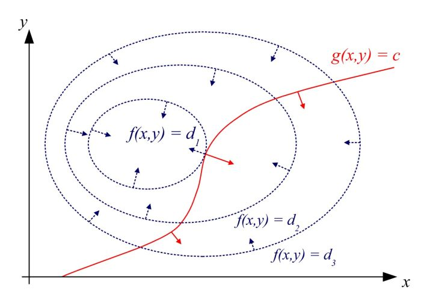

## 矩阵求最小二乘法 (超正定矩阵求解)

问题: 假设我们有 m 个方程组, 但是只有 n 个未知数 (n 小于 m), 即: 方程组的个数大于未知数的个数. 我们知道, 当方程个数与未知数个数相等时, 则方程有解. 大于时, 方程无解. 
在实际的工作中, 由于采集到的数据与真实值有误差. 所以, 我们用大量的数据去求有限的未知参数. 这时为了能够考量到与有的数据, 则采用最小二乘法, 即, 使得误差最小. 

有方程组: 
$$Y = AX$$

1. m > n
2. A 是 m 行 n 列的矩阵
3. X 是 n 行 1 列的向量
4. Y 是 m 行 1 列的向量

现要求得一组向量 X 使得 $(AX-Y)^{T}(AX-Y)$ 的值最小, 即误差的平方和最小.

$$(AX-Y)^{T}(AX-Y) = (X^{T}A^{T}-Y^{T})(AX-Y) = X^{T}A^{T}AX - Y^{T}AX - X^{T}A^{T}Y + Y^{T}Y$$
求上式对 X 的导数.
为: $2X^{T}A^{T}A - 2Y^{T}A$
求导数为 0 的解: $X = (A^{T}A)^{-1}A^{T}Y$
导数为 0 时的 X, 使得最小二乘值最小. 

#### 求导的细节: 
$X^{T}A^{T}AX$ 对 $X$ 求导: 
1. 在 $X$ 上加一个 $\delta X$ 增量.
  $$(X^{T}+\delta X^{T})A^{T}A(X+\delta X) = X^{T}A^{T}AX + X^{T}A^{T}A\delta X + \delta X^{T}A^{T}AX + \delta X^{T}A^{T}A\delta X$$

2. 上式减去 $X^{T}A^{T}AX$ : 

  $$X^{T}A^{T}A\delta X + \delta X^{T}A^{T}AX + \delta X^{T}A^{T}A\delta X$$

3. 上式除去 $\delta X$ 便是导数: 

   第一项: $X^{T}A^{T}A\delta X$ 显然结果是: $X^{T}A^{T}A$
   第二项 $\delta X^{T}A^{T}AX$ 是一个值. 一个值的转置, 还是它本身. 我们对它执行一个转置:  $X^{T}AA^{T}\delta X$, 则第二项是 $X^{T}AA^{T}$. 
   第三项是无穷小, 当作 0.
   于是导数为: $X^{T}A^{T}A + X^{T}AA^{T}$

4. 此处: $A^{T}A$ 是对称矩阵, $A^{T}A =AA^{T}$ 所以导数为: $2X^{T}A^{T}A$ 转置一下为: $2A^{T}AX$ n 行 1 列.

   * 矩阵求导时应该先理解求导的过程实际上是对线性方程组中 各因变量对各等式, 各自变量求导. 
   * 如果一组矩阵的运算结果是一个数值, 则对这组矩阵进行转置, 结果应该是不变的. 
   * 不能将对 $x$ 求导和对 $x^{T}$ 求导混为一谈. 如果对 x 求导时, 矩阵组中只有 $x^{T}$ 则应注意是否可以对这个矩阵组进行转置再消除 x 项. 

### 协方差矩阵的特征向量
求解: 为什么在 PCA 主成分分析中, 使用协方差矩阵的特征向量对数据进行变换, 可以使变换后的数据协方差矩阵对角化. 

* **正交矩阵**
    如果 n 阶矩阵 A 满足: $A^{T}A = E$ (即: $A^{-1} = A^{T}$), 那么称 A 为正交矩阵, 简称正交阵.  

* **特征向量**
    设 A 是 n 阶矩阵, 如果数 λ 和 n 维非零向量 x 使关系式 $Ax = λx$ 成立, 那么, 这样的数 λ 称为矩阵 A 的特征值, 非零向量 x 称为 A 的对应于特征值 λ 的特征向量. 
    每一个矩阵都对应了一个线性变换, 而如果一个矩阵所对应的线性变换是在 n 维空间中沿 n 个彼此正交的方向上进行伸缩变换时, 这个矩阵具有 n 个正交的特征向量, 和 n 个特征值. 

* **矩阵对角化条件**
    存在可逆矩阵 S, 使得 $S^{-1}AS$ 为对角矩阵, 则称矩阵 A 是可对角化的. 
设 $n \times n$ 矩阵有 n 个线性无关的特征向量 $x_{1}, x_{2}, ..., x_{n}$, 令 $S = (x_{1}, x_{2}, ...x_{n})$, 则: 
$$AS = A(x_{1}, x_{2}, ..., x_{n}) = (\lambda_{1} x_{1}, \lambda_{2} x_{2}, ..., \lambda_{n} x_{n}) = (x_{1}, x_{2}, ..., x_{n})
\left[
\begin{matrix}
\lambda_{1}    &      &     & \\
&    &\lambda_{2}    &     & \\
&    &    &  ......       & \\
&    &    &     &\lambda_{n}  \\
\end{matrix}
\right]$$

$$AS = A \Lambda \Rightarrow S^{-1}AS = \Lambda \Rightarrow AS = S \Lambda$$
根据特征向量的定义, 可以看出, 其中 $S$ 为特征向量, $\Lambda$ 为特征值. 

#### 推导
求出 Cov 的特征值与特征向量分别为: $S, \Lambda$.  根据特征值与特征向量的定义有: 
$$CovS = S \Lambda$$
$$CovS = S \Lambda \Rightarrow S^{-1}CovS = \Lambda$$
已知: $A^{T}A = Cov$: 
得出: 
$$S^{-1}A^{T}AS = \Lambda$$
此处我们需要 $S^{-1} = S^{T}$, 则需要 S 为正交矩阵, 也就是说需要 $Cov$ 的特征向量为 n 个相互正交的单位向量. 现在假设 S 确是正交矩阵, 则: 
$$S^{-1}A^{T}AS = \Lambda \Rightarrow S^{T}A^{T}AS = \Lambda$$
因此, 只要用 $Cov$ 协方差矩阵的特征向量去变换数据矩阵 $A$ 就可以使变换后的矩阵 $AS$ 的协方差矩是对角矩阵. 

在什么情况下, 协方差矩阵的特征向量不为正交矩阵, 不为正交矩阵时是什么情况. 我不知道. 

***
### 方向导数

对于二元函数 $f(x, y)$, 我们求其在任意方向 $(u, v)$ 方向上的导数. 那么我们将 $x$, $y$ 都表示为 $t$ 的函数 $ut$, $vt$, $t$ 是任意方向上的移动增量一般认为是 1, $(u, v)$ 则是其在 x, y 方向上的分量. 有:

$f(x+ut, y+vt) = f(x, y) + \int_{x}^{x+ut}{f_{x}^{'}{(x, y)dx}} + \int_{y}^{y+vt}{f_{y}^{'}{(x+ut, y)dy}}$

其中:

${f_{y}^{'}{(x+ut, y)}} = f_{y}^{'}{(x, y)} + \int_{x}^{x+ut}f_{yx}^{''}{(x, y)}dx$

代入上式:

$f(x+ut, y+vt) = f(x, y) + \int_{x}^{x+ut}{f_{x}^{'}{(x, y)dx}} + \int_{y}^{y+vt}{f_{y}^{'}{(x, y)dy}} + \int_{x}^{x+ut} \int_{y}^{y+vt}{f_{yx}^{''}{(x, y)dydx}}$

舍去二阶导数的部分:

$$\begin{aligned}
f(x+ut, y+vt) &= f(x, y) + f_{x}^{'}{(x, y)}ut + f_{y}^{'}{(x, y)}vt \\
\frac{f(x+ut, y+vt) - f(x, y)}{t} &= f_{x}^{'}{(x, y)}u + f_{y}^{'}{(x, y)}v \\
\frac{\partial f}{\partial t} &= \frac{\partial f}{\partial x} u + \frac{\partial f}{\partial y} v 
\end{aligned}$$

所以 $t(u, v)$ 方向上的导数就是求函数在 $x$, $y$ 方向上的偏导数乘以对应方向上的分量大小.

给定一个二元函数, 求解导数最大的方向.

令 $u = sin \theta$, $v = cos \theta$, 使其满足 $u^{2} + v^{2} = 1$.

$F = \frac{\partial f}{\partial t} = \frac{\partial f}{\partial x} \times sin \theta + \frac{\partial f}{\partial y} \times cos \theta$

求方向导数最大的方向, 就是求上式最大的 $\theta$ 值. 令 $F$ 对 $\theta$ 求导:

$\frac{\partial F}{\partial \theta} = \frac{\partial f}{\partial x} \times cos \theta - \frac{\partial f}{\partial y} \times sin \theta$

令 $F$ 的一阶导数为 0, 则:

$\frac{f_{x}^{'}{(x, y)}}{f_{y}^{'}{(x, y)}} = \frac{sin \theta}{cos \theta} = \frac{u}{v}$

所以方向导数最大的方向 $(u, v)$ 与向量 $(f_{x}^{'}{(x, y)}, f_{y}^{'}{(x, y)})$ 在同一方向.

***
### 拉格朗日乘子法

设给定二元函数 $z=ƒ(x,y)$ 和附加条件 $φ(x,y)=0$，为寻找 $z=ƒ(x,y)$ 在附加条件下的极值点. 

#### 推导
求 $z = f(x, y)$ 函数在给定条件 $y = g(x)$ 下的极值.

解:

$y = g(x)$, 是一个曲线方程. $z = f(x, y)$ 是一个曲面方程.

也就是说, 在曲面画上一条曲线, 求曲线上曲面的极值.

解题思路:

延着曲线的方向对曲面进行求导. 导数为零的地方为极值点. (就好像延着山路登山, 某时发现前面的路和后面的路都是往下/往上, 则当前位置是极值点).

对 $y = g(x)$ 求导, 得: $\frac{\bigtriangleup y}{\bigtriangleup x} = g^{'}(x)$, 也就是说, 在任意位置的曲线方向 $(u, v)$ 可以表示为: $(1, g^{'}(x))$, (不过这里的模长不为 1).

那么在任意位置, 曲面在该方向上的导数为:

$\frac{\partial f}{\partial t} = \frac{\partial f}{\partial x} \times 1 + \frac{\partial f}{\partial y} \times g^{'}(x) = f_{x}^{'}(x, y) + f_{y}^{'}(x, y) \times g^{'}(x)$

则, 令 $f_{x}^{'}(x, y) + f_{y}^{'}(x, y) \times g^{'}(x) = 0$ , 就可以得到极值点.

由于拉格朗日乘子法中的公式不是使用的 $y = g(x)$ 而是 $g(x, y) = 0$, 这里我们将条件函数看作: $k = g(x, y), k = 0$.

$k = g(x, y)$ 表示一个曲面, 当 k 为任意常数时, 其表示此曲面的任意等值曲线, 所以 $g(x, y) = 0$ 其实是该曲面的某一等值曲线. 求任意点 $(x, y)$ 处方程全微分为 0 的导数方向, 就是该等值曲线的切线方向.

$\frac{\partial k}{\partial x} = g_{x}^{'}{(x, y)}$

$\frac{\partial k}{\partial y} = g_{y}^{'}{(x, y)}$

令: $\frac{\partial k}{\partial x}u + \frac{\partial k}{\partial y}v = 0$, 则 $(u. v)$ 可以取值为: $(1, - \frac{g_{x}^{'}{(x, y)}}{g_{y}^{'}{(x, y)}})$, 此为条件函数曲面上每一个点 $(x, y)$ 处的等值线的方向.

求曲面 $z=f(x, y)$ 在 $k=g(x, y)$ 曲面任意等值线方向上的极值. 等价于求以下方程:

$f_{x}^{'}{(x, y)} \times 1 + f_{y}^{'}{(x, y)} \times {(-\frac{g_{x}^{'}{(x, y)}}{g_{y}^{'}{(x, y)}})} = 0$

得出:

$\frac{f_{x}^{'}{(x, y)}}{g_{x}^{'}{(x, y)}} = \frac{f_{y}^{'}{(x, y)}}{g_{y}^{'}{(x, y)}}$

得出:

$f_{x}^{'}{(x, y)} + \lambda g_{x}^{'}{(x, y)} = 0$

$f'_{y}(x, y) + \lambda g_{y}^{'}{(x, y)} = 0$

条件函数规定: $g(x, y) = 0$.

上面三个等式就是求, 在 $k = 0$ 时, 曲面 $k = g(x, y)$ 的等值曲线上曲线 $z = f(x, y)$ 的极值点. 其中 $\lambda$ 取任意常数, 三个等式需同时成立. 等阶于求下式的一阶导数为 0 的点.

$F(x, y, \lambda) = f(x, y) + \lambda g(x, y)$